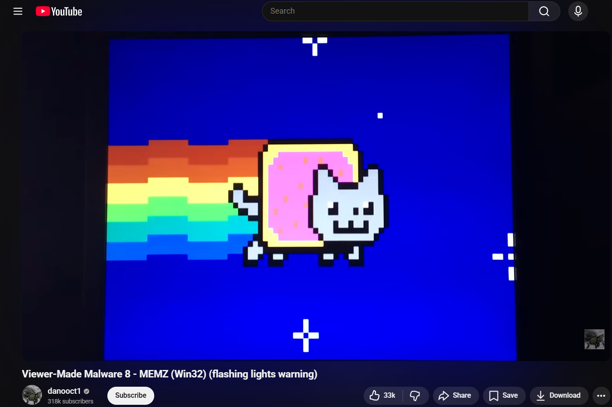
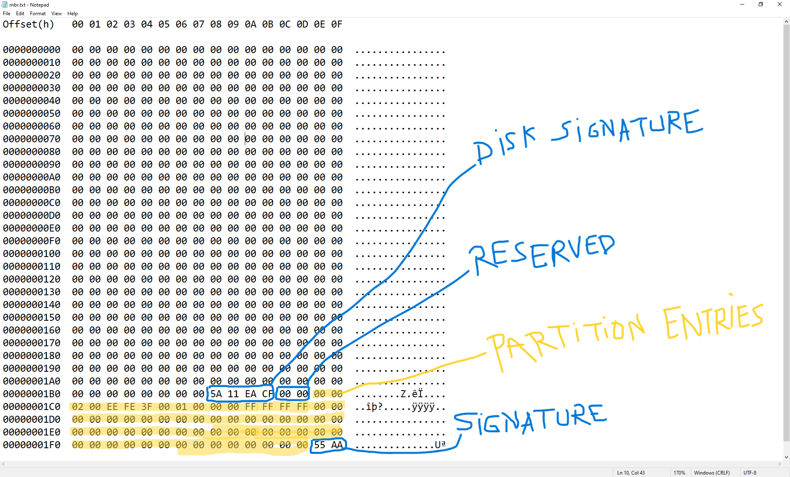
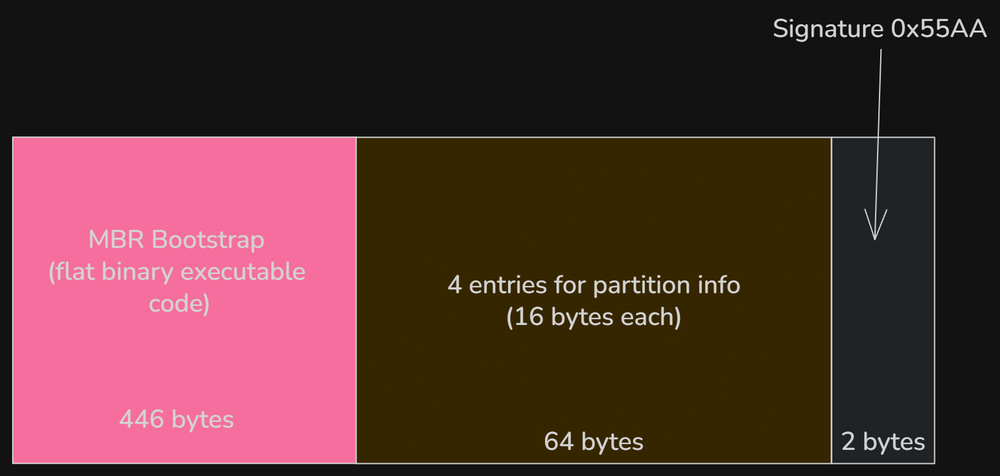

## 1. Introduction
Computer viruses was not always about making money. Back in the day, when I was not even born yet, they where created by hobyist to display prank messages, corrupt files, slow down system and sometimes delete data. The big difference from modern malware is that most of them were not created for financial reason. Thanks to Youtube recomendation, I stumble across the Youtube channel **danooct1** , where he made a series of video where he runs viewer made malware for fun. Most of them make the computer glitches in humorous way.  

One that caught my intention was the __MEMZ trojan__ that was created by the youtuber __Leurak__ and given to danooct1. What it does was moving the mouse cursor, openning random websites, causing system errors and creating screen tunneling effects. The final blow was overwriting the Master Boot Record; and when rebooting the pc, a video of a cat with rainbow and a music starts to play  

  

I was really fun and interesting to watch, since I've done no research on how the boot process until now. In this article, we're going to demystify the MBR, its role in booting and how it can be manipulated programmatically.

> [!WARNING]
> **This is for education; messing with the MBR can cause data loss or require OS reinstalls. Proceed with caution, or do whatever you want. Duh!**

## 2. What is the MBR?
The MBR is the very first sector of a storage device which contains machine code to be loaded into RAM and then executed by the BIOS when it boots a hard diks. It is a 512-byte data structure containing system bootstrap code necesarry only when booting and a partition table. The first 440 bytes (which can be extended to 446 bytes if the next 2 fields is omitted) is the bootloader code, responsible for locating and load the bootable partition and start the OS bootloader (like GRUB). This is followed by the partition table which consist of 4 entries of 16 bytes each and ended by the value 0x55AA which is a signature for a valid boot sector.  
To get a view of the MBR on Windows, run HxD as admin. In the toolbar, select Tools->open disk and select the physical hard drive. The first sector of the disk (512 bytes) is the MBR.
>Note: Open in read-only mode to prevent accidental modification.



This is from an already-installed Windows 10 OS, the result might be different if other drive is used.
The first 440 bytes in this image is the bootstrap code area responsible for finding and loading the active partition's Volume Boot Record or VBR. Normally this area contains boot loader code. However on GPT disks, UEFI firmware doesn't rely on the MBR bootstrap code. Instead it reads the GPT headers starting at sector 1 and load the bootloader from the EFI System Partition.

## 3. Classic BIOS boot process
When a computer is turned on, the first thing the CPU does it to look for the __BIOS__ (or the __UEFI__ on modern devices) and runs it. After the BIOS starts running, it start a proces called POST(POWER-On Self-Test)
and chechs for hardware components like RAM, CPU, storage devices, etc. If this succeed, it proceeds to the bootloader. This is where the MBR comes in; the firmware looks for a bootable device like USB, SSD or DVD. The boot order depends on the BIOS settings.  Once it finds a bootable device, it loads the boot code from the first sector of the disk: the master Boot Record.



The BIOS then loads the MBR into RAM, at memory address 0x7C00 and executes the MBR bootloader code. The MBR bootloader finds the active partition and loads that partition's boot sector, which in turn loads the OS bootloader (GRUB for linux and Windows Boot Manager for Windows). The OS kernel loads into memory and the system starts.  

On modern computer, the UEFI replaces the BIOS which makes the booting process very different. It reads the __GPT__ partition table directly (starting from sector 1) and loads the EFI bootloader from the EFI System Partition. For a detailed explanation, check [this](https://en.wikipedia.org/wiki/UEFI#Boot_stages).

## 4. How MEMZ corrupts the MBR
Time for the fun part.
The MEMZ trojan has multiple payloads. One of them is automatic google search with, well, very questionning queries. The funniest of them in my opinion are the following
```c
const char *sites[] = {
	"http://google.co.ck/search?q=best+way+to+kill+yourself",
	"http://google.co.ck/search?q=how+2+buy+weed",
	"http://google.co.ck/search?q=facebook+hacking+tool+free+download+no+virus+working+2016",
	"http://google.co.ck/search?q=internet+explorer+is+the+best+browser",
	// ...
}
```
The most destructive payload overwrites the first 64 KiB (128 sectors) of the physical drive (`\.\PhysicalDrive0`) with custom boot code + an embedded Nyan Cat animation (including simple 8-bit music).
This completely wipes the original MBR, any protective GPT structures (if the disk was GPT), and the beginning of the first partition(s), making normal booting impossible and often causing file system corruption.
```c
	HANDLE drive = CreateFileA("\\\\.\\PhysicalDrive0", GENERIC_READ | GENERIC_WRITE, FILE_SHARE_READ | FILE_SHARE_WRITE, 0, OPEN_EXISTING, 0, 0);
```
It then allocates memory for the bootcode and writes it directly to the drive.
```c
	unsigned char *bootcode = (unsigned char *)LocalAlloc(LMEM_ZEROINIT, 65536);
	// ....
	if (!WriteFile(drive, bootcode, 65536, &wb, NULL))
		ExitProcess(3);
```
On modern UEFI-based computers, the MBR bootstrap code is ignored during normal boot. However, overwriting the first 64 KiB still destroys the protective MBR on GPT disks and corrupts the start of the first partition, rendering the system unbootable.

## 5. Conclusion
This was a short but very enjoyable article to work on. I’ll create more content on malware in the future. Until then, stay safe online, and see you next time! :)
