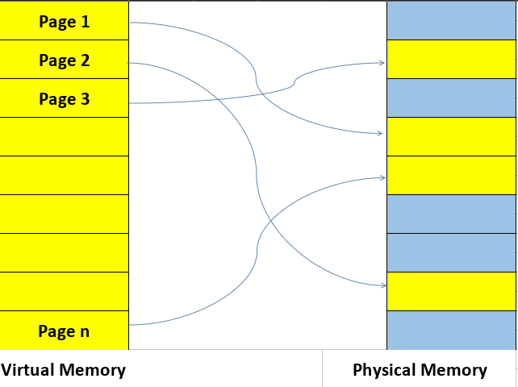
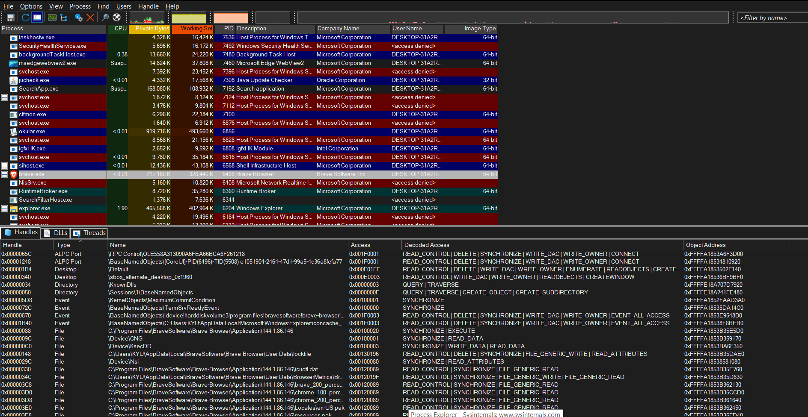
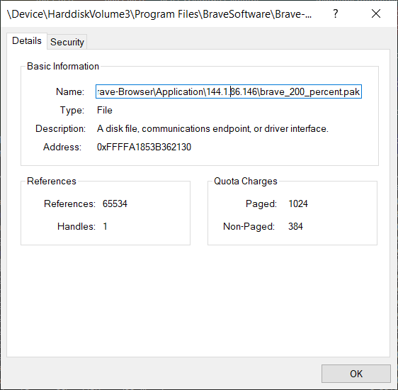
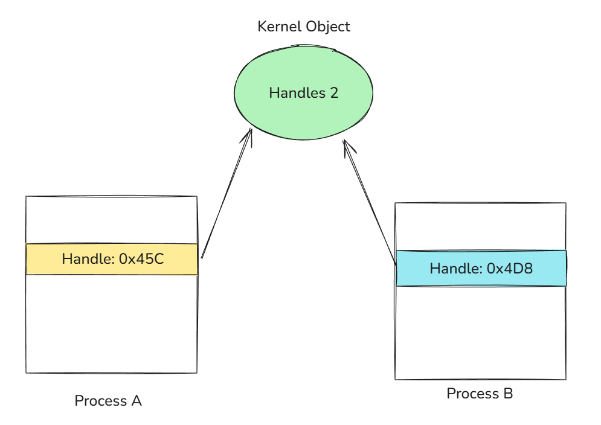

## Introduction
People often confuse the term process with a program. A process doesn't run a program—it's a container and management object that represents a running instance of a program. In this article we'll be diving into the structures that make up a process and see why they matter.

## 1. Virtual Address Space
Each process has a Virtual Address Space for its use, or VAS for short. The VAS is an area of contiguous virtual memory locations which the OS makes available to a process for executing instructions and storing data. The VAS is private; no other processes can access it directly.  
- On a 32-bit process running on a 32-bit Windows system, the virtual address space is 4 GB in total, with 2 GB available to user mode by default and 2 GB reserved for the kernel.
- On a 64-bit process running on a 64-bit Windows system, the user-mode virtual address space is 8 TB by default (from Windows 8.1 and later).

The address space is split into two major regions: user space and kernel space. The user portion is private; this is what the process uses for storing data, code, heaps, stacks, and loaded modules. It is located in the lower address space. The kernel space, on the other hand, is in the higher address space. It is global and is used by the kernel naturally and cannot be accessed directly by user-mode processes. This separation prevents user applications from accessing and/or modifying critical OS data.


### 1.1 VAS and Physical Storage
The VAS of each process can be larger than the total RAM available. To increase the size of physical storage, the system can use the disk for additional storage.  

Physical storage and the VAS of each process are divided into fixed-size units called **pages**, typically 4 KB in size. The paging file (and the physical RAM) are all types of backing store for committed pages and allow the system to overcommit beyond available physical RAM. How the paging file works is that when the RAM starts filling up, Windows moves inactive pages from RAM to the paging file so they have a place they can be retrieved from if not in RAM. This allows a process to use more memory.  
**Note**: x64 supports large pages (2 MB up to 1 GB).

### 1.2 Memory Allocation Types
Windows does not treat all virtual memory equally. Each region in a process's VAS has a type and a purpose, which determines how it behaves and how it is backed by physical storage.  
The main allocation types are:  

| Memory Type | Description | Key Characteristics |
|-------------|-------------|---------------------|
| **Free** | Memory that is neither committed nor reserved and is available for future allocations. | • Available for allocation<br>• Not reserved or committed<br>• No physical storage assigned |
| **Reserved** | Memory that has been reserved for future use but is not yet accessible. | • Address range protected from other allocations<br>• Not yet accessible<br>• No physical storage backing it yet<br>• Can later be committed |
| **Committed** | Memory that has physical storage (RAM or paging file) backing it and is accessible. | • Has physical storage backing<br>• Accessible to processes<br>• Backed by RAM or paging file |

### 1.3 Memory Manager and Virtual Address Descriptor
Each process gets its own private VAS. This gives it the illusion of having large, contiguous sections of memory. Physically, the memory of a process is dispersed across different areas of physical memory (RAM) or paged out to the disk (paging file). As stated before, the VAS is divided into pages. When a page is referenced by a program, it is mapped into a physical page that resides in physical memory.  
Each process has a [page table](https://en.wikipedia.org/wiki/Page_table) that maps virtual addresses to physical memory locations. To simplify, the process gives a page and the OS finds the physical address in RAM.



What does the Memory Manager do in all of this? It manages the VAS for processes, deciding which pages stay in RAM, handling page faults, tracking page state (remember: free, reserved, and committed), and more. While the final translation from virtual to physical address is performed by the CPU's Memory Management Unit (MMU) using page tables, the Memory Manager populates and manages those structures, handles page faults, decides which pages stay in RAM or are paged to disk, and tracks the state of all memory regions. More details [here](http://en.wikipedia.org/wiki/Page_table)  

The Memory Manager needs to track the state of contiguous virtual memory regions in a process's address space. For that, it uses the Virtual Address Descriptor (VAD). The VAD is a tree structure that describes the ranges of a process's VAS. It stores information about allocation type (private/shared), memory protection (read/write/execute, etc.). When a page is first accessed, the Memory Manager consults the VAD to determine its backing store, sets up the corresponding table entry, and lets the Memory Management Unit or the [MMU](https://en.wikipedia.org/wiki/Memory_management_unit) handle subsequent translation.

## 2. Handle
Windows is an object-based operating system, exposing various types of objects for use by user-mode processes and the kernel itself. An object, also called a kernel object, is a data structure that represents a system resource such as a file, thread, or process. Those kernel objects reside in kernel space and can't be accessed directly. For an application to use them, it must use a **HANDLE**.  
While the Win32 API defines a handle as a **void** pointer:
```c
typedef void *HANDLE;
```
it's an opaque identifier used by Windows to reference a kernel object and should not be used like a regular pointer; its value should never be manipulated directly.

## 2.1 Handle Table
A handle itself is an integer value (like `0x90`) in multiples of 4. It acts as an index into a data structure—the handle table—maintained by the kernel. Each process has its own private handle table. Each entry in this table contains a pointer to the actual kernel object, the access rights, and specific flags. You can inspect a program's handles using **Process Explorer**.



## 2.2 The OBJECT_HEADER and Kernel Object Types
Every kernel object in Windows is wrapped with an OBJECT_HEADER. The `OBJECT_HEADER` is a structure managed by the Object Manager. It is placed immediately before an object in memory to provide metadata and services such as object naming, reference counting, security checks, and lifetime management.

When a handle is created, it is assigned an **access mask** (see the "Access" column in the image above). This is crucial because the object itself doesn't enforce permissions—the handle does. This means two different processes can point to the same object but have entirely different permissions.

> **Note:** This is why open handles must be closed. If a high-privilege process leaks a handle to a sensitive object, a lower-privilege process might be able to hijack it if it can gain access to that process's handle table. If C++ is used, consider using RAII for handles.

There are various types of handles. In Process Explorer, we can see exactly what kind of object a handle is referencing. By double-clicking one, we can view more details. In the image below, the object is a **File** type used by the process (in this case, Brave Browser).



## 2.3 Duplicate Handles
Duplicating a handle does **not** duplicate the underlying object. Instead, Windows creates a new table entry in the process that points to the same kernel object.

Kernel objects are reference-counted. The Object Manager maintains both a **handle count** and a **pointer count**; the sum of these represents the total reference count for an object. When a handle is duplicated, the reference count increases. Only when both the handle count and pointer count reach zero is the object destroyed.


---

## 3. The Process Environment Block or PEB
The PEB is a user-mode data structure residing in a process's VAS that contains information about a running process, including details on loaded modules, command-line parameters, environment variables, and more. The layout of the PEB is not documented, so we're going to rely on WinDbg to see its full structure. Our first command is `dt`, which stands for "Display type"; this allows us to display information about a data type and its offset in memory.
```
0:000> dt _PEB
ntdll!_PEB
   +0x000 InheritedAddressSpace : UChar
   +0x001 ReadImageFileExecOptions : UChar
   +0x002 BeingDebugged    : UChar
   +0x003 BitField         : UChar
   +0x003 ImageUsesLargePages : Pos 0, 1 Bit
   +0x003 IsProtectedProcess : Pos 1, 1 Bit
   +0x003 IsImageDynamicallyRelocated : Pos 2, 1 Bit
   +0x003 SkipPatchingUser32Forwarders : Pos 3, 1 Bit
   +0x003 IsPackagedProcess : Pos 4, 1 Bit
   +0x003 IsAppContainer   : Pos 5, 1 Bit
   +0x003 IsProtectedProcessLight : Pos 6, 1 Bit
   +0x003 IsLongPathAwareProcess : Pos 7, 1 Bit
   +0x004 Padding0         : [4] UChar
   +0x008 Mutant           : Ptr64 Void
   +0x010 ImageBaseAddress : Ptr64 Void
   +0x018 Ldr              : Ptr64 _PEB_LDR_DATA
   +0x020 ProcessParameters : Ptr64 _RTL_USER_PROCESS_PARAMETERS
   +0x028 SubSystemData    : Ptr64 Void
   +0x030 ProcessHeap      : Ptr64 Void
   +0x038 FastPebLock      : Ptr64 _RTL_CRITICAL_SECTION
   +0x040 AtlThunkSListPtr : Ptr64 _SLIST_HEADER
   +0x048 IFEOKey          : Ptr64 Void
   +0x050 CrossProcessFlags : Uint4B
   +0x050 ProcessInJob     : Pos 0, 1 Bit
   +0x050 ProcessInitializing : Pos 1, 1 Bit
   +0x050 ProcessUsingVEH  : Pos 2, 1 Bit
   +0x050 ProcessUsingVCH  : Pos 3, 1 Bit
   +0x050 ProcessUsingFTH  : Pos 4, 1 Bit
   +0x050 ProcessPreviouslyThrottled : Pos 5, 1 Bit
   +0x050 ProcessCurrentlyThrottled : Pos 6, 1 Bit
   +0x050 ProcessImagesHotPatched : Pos 7, 1 Bit
   +0x050 ReservedBits0    : Pos 8, 24 Bits
   +0x054 Padding1         : [4] UChar
   +0x058 KernelCallbackTable : Ptr64 Void
   +0x058 UserSharedInfoPtr : Ptr64 Void
   +0x060 SystemReserved   : Uint4B
   +0x064 AtlThunkSListPtr32 : Uint4B
   +0x068 ApiSetMap        : Ptr64 Void
   +0x070 TlsExpansionCounter : Uint4B
   +0x074 Padding2         : [4] UChar
   +0x078 TlsBitmap        : Ptr64 Void
   +0x080 TlsBitmapBits    : [2] Uint4B
   +0x088 ReadOnlySharedMemoryBase : Ptr64 Void
   +0x090 SharedData       : Ptr64 Void
   +0x098 ReadOnlyStaticServerData : Ptr64 Ptr64 Void
   +0x0a0 AnsiCodePageData : Ptr64 Void
   +0x0a8 OemCodePageData  : Ptr64 Void
   +0x0b0 UnicodeCaseTableData : Ptr64 Void
   +0x0b8 NumberOfProcessors : Uint4B
   +0x0bc NtGlobalFlag     : Uint4B
   +0x0c0 CriticalSectionTimeout : _LARGE_INTEGER

   
```
There's a lot going on inside the PEB; we're going to focus on Ldr at offset 0x018.  
The Ldr field is a pointer to the PEB_LDR_DATA structure. This structure is the primary way the Windows image loader tracks every library mapped into a process's memory.
```
0:000> dt _PEB_LDR_DATA
ntdll!_PEB_LDR_DATA
   +0x000 Length           : Uint4B
   +0x004 Initialized      : UChar
   +0x008 SsHandle         : Ptr64 Void
   +0x010 InLoadOrderModuleList : _LIST_ENTRY
   +0x020 InMemoryOrderModuleList : _LIST_ENTRY
   +0x030 InInitializationOrderModuleList : _LIST_ENTRY
   +0x040 EntryInProgress  : Ptr64 Void
   +0x048 ShutdownInProgress : UChar
   +0x050 ShutdownThreadId : Ptr64 Void
   
```

The most interesting fields here are the three LIST_ENTRYs:
- InLoadOrderModuleList
- InMemoryOrderModuleList
- InInitializationOrderModuleList

A LIST_ENTRY is a doubly linked list structure. Even though WinDbg suggests the structure contains LIST_ENTRY directly, there's actually more:
```
0:000> dt _LIST_ENTRY
ntdll!_LIST_ENTRY
   +0x000 Flink            : Ptr64 _LIST_ENTRY
   +0x008 Blink            : Ptr64 _LIST_ENTRY
```
Each LIST_ENTRY node lives inside a larger structure called LDR_DATA_TABLE_ENTRY, which represents a single loaded module.

```
0:000> dt _LDR_DATA_TABLE_ENTRY
ntdll!_LDR_DATA_TABLE_ENTRY
   +0x000 InLoadOrderLinks : _LIST_ENTRY
   +0x010 InMemoryOrderLinks : _LIST_ENTRY
   +0x020 InInitializationOrderLinks : _LIST_ENTRY
   +0x030 DllBase          : Ptr64 Void
   +0x038 EntryPoint       : Ptr64 Void
   +0x040 SizeOfImage      : Uint4B
   +0x048 FullDllName      : _UNICODE_STRING
   +0x058 BaseDllName      : _UNICODE_STRING
```  
Each loaded module has one _LDR_DATA_TABLE_ENTRY, and that structure embeds three separate LIST_ENTRYs:
```
+------------------------------------------------+
|           LDR_DATA_TABLE_ENTRY                 |
|                                                |
|  +--------------------------+                  |
|  | InLoadOrderLinks         |  (LIST_ENTRY)    |
|  +--------------------------+                  |
|                                                |
|  +--------------------------+                  |
|  | InMemoryOrderLinks       |  (LIST_ENTRY)    |
|  +--------------------------+                  |
|                                                |
|  +--------------------------+                  |
|  | InInitializationOrderLinks| (LIST_ENTRY)    |
|  +--------------------------+                  |
|                                                |
|  DllBase                                       |
|  FullDllName                                   |
|  BaseDllName                                   |
+------------------------------------------------+
```
I'll be using a RAII wrapper for handle, you can find it with the complete program [here](https://github.com/0xGaze/EnumDll).  

One classic use of the PEB, especially the Ldr field, is position-independent code, such as shellcode. Shellcode can't rely on imported functions or hardcoded module base addresses. Instead, it must discover everything at runtime. Since the PEB is always accessible, by walking the loader lists, shellcode can locate the address of kernel32.dll.  
Everything shown here applies to 64-bit processes running on 64-bit Windows. Offsets and structure layouts are undocumented and subject to change across Windows versions.  
The first thing we need is the address of the target process's PEB. The recommended way to retrieve it is via `NtQueryInformationProcess` with the `ProcessBasicInformation` class.
```cpp
DWORD pid = (DWORD)atoi(argv[1]); // the process id of the target process
unique_handle processHandle {
    OpenProcess(PROCESS_QUERY_INFORMATION | PROCESS_VM_READ, FALSE, pid
};

PROCESS_BASIC_INFORMATION pbi;
NTSTATUS ntstatus = NtQueryInformationProcess(
    processHandle,
    ProcessBasicInformation,
    &pbi,
    sizeof(pbi),
    nullptr
);
// getting the base addr of PEB
void* peb = pbi.PebBaseAddress;
```
Then we need the value of Ldr, which is a pointer to PEB_LDR_DATA in the target process. Here we're using `ReadProcessMemory` cause that's our only way of reading another process's memory. Remember, the VAS is private so doing this: `void* ldr = *(void**)((char*)peb + 0x018);` only works if a process access its own VAS, not others.
```cpp
void* ldr = nullptr;
SIZE_T bytesRead;
BOOL ok = ReadProcessMemory(
    processHandle.get(),
    (char*)peb + 0x018,
    &ldr,
    sizeof(ldr),
    &bytesRead
);

if (!ok || bytesRead != sizeof(ldr)) {
    DWORD err = GetLastError();
    std::cerr << "ReadProcessMemory failed: " << err;
    return 1;
}
```

We'll read the InLoadOrderModuleList, which is located at offset 0x010 inside the _PEB_LDR_DATA. The list is a circular doubly linked list, and the head does not represent a module.
```cpp
LIST_ENTRY entry {};
ok = ReadProcessMemory(
    processHandle.get(),
    (char*)ldr + 0x010,
    &entry,
    sizeof(LIST_ENTRY),
    nullptr
);

if (!ok) {
    DWORD err = GetLastError();
    std::cerr << "ReadProcessMemory LIST_ENTRY failed: " << err;
    return 1;
}
// the head of the list is empty
PLIST_ENTRY headAddr = (PLIST_ENTRY)((char*)ldr + 0x10);
// the next node contains the first data
PLIST_ENTRY current = entry.Flink;
```
Each node list is inside an _LDR_DATA_TABLE_ENTRY. Since InLoadOrderLinks is the first field in the structure, the list pointer is the structure address.
```cpp
std::vector<std::wstring> dllNameList {};
while (current != headAddr) {
    LDR_DATA_TABLE_ENTRY64 tableEntry {};
    ReadProcessMemory(processHandle.get(), (char*)current, &tableEntry, sizeof(LDR_DATA_TABLE_ENTRY64), nullptr);
    UNICODE_STRING fullDllName = tableEntry.FullDllName;
    if (fullDllName.Buffer && fullDllName.Length) {
        std::vector<wchar_t> buffer (fullDllName.Length / sizeof(wchar_t));
        ReadProcessMemory(processHandle, fullDllName.Buffer, buffer.data(), buffer.size() * sizeof(wchar_t), nullptr);
        std::wstring dllName;
        dllName.assign(buffer.begin(), buffer.end());
        dllNameList.push_back(dllName);
    }
    current = tableEntry.InLoadOrderLinks.Flink;
}
```
As mentioned earlier, the PEB is undocumented, so we must define our own LDR_DATA_TABLE_ENTRY structure based on what we saw in WinDbg.

```cpp
typedef struct _LDR_DATA_TABLE_ENTRY64 {
    LIST_ENTRY InLoadOrderLinks;          // offset 0x0
    LIST_ENTRY InMemoryOrderLinks;        // offset 0x10
    LIST_ENTRY InInitializationOrderLinks;// offset 0x20
    PVOID DllBase;                        // offset 0x30
    PVOID EntryPoint;                     // offset 0x38
    ULONG SizeOfImage;                    // offset 0x40
    UNICODE_STRING FullDllName;           // offset 0x48
    UNICODE_STRING BaseDllName;           // offset 0x58
} LDR_DATA_TABLE_ENTRY64, *PLDR_DATA_TABLE_ENTRY64;
```
Running this against a Notepad process yields:
```
>a.exe 13268
C:\Windows\system32\NOTEPAD.EXE
C:\Windows\SYSTEM32\ntdll.dll
C:\Windows\System32\KERNEL32.DLL
C:\Windows\System32\KERNELBASE.dll
C:\Windows\System32\GDI32.dll
C:\Windows\System32\win32u.dll
C:\Windows\System32\gdi32full.dll
```
This is exactly the information the Windows loader itself uses and exactly what shellcode leverages to bootstrap execution.

That's all for this article. I hope you learned something useful. If you have any review or feedback, please send me an email; I'll gladly read it. Until next time.
