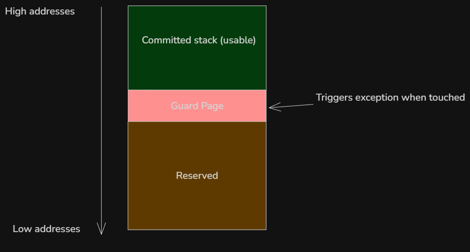
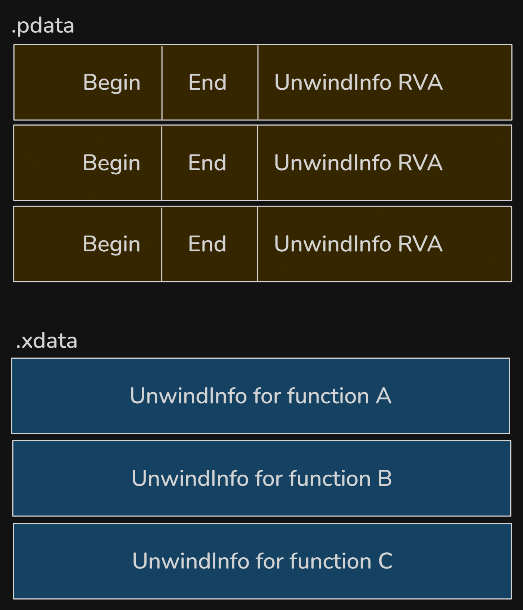

__Note__: This aricle is an in-depth exploration of Windows thread internals, and I feel the need to mention that I am not a professional or master of everything that will be discussed here. While I aim for technical accuracy, corrections are welcome.

## 1. A little background
To understand Windows thread internals, we must clarify several foundational concepts.

### 1.1 Process vs Thread
A process is a container for a set of resources used when executing an instance of a program. It holds what the program needs for running, this include a private virtual address space, one or more threads, loaded libraries (DLLs) and more.
A thread is the fundamental unit of CPU scheduling in Windows. Without at least, the process's program can't run. A thread includes the following essential components:
- The contents of a set of CPU registers representing the state of the processor
- Two stacks--one for the thread to use while executing in kernel mode and one for executing in user mode
- A private storage area called thread-local storage (TLS) for use by subsystems, run-time libraries and DLLs
- A unique identifier called a thread ID (part of an internal structure called a client ID; process IDs and thread IDs are generated out of the same namespace, so they never overlap)

### 1.2 Kernel objects
A kernel object is a data structure managed by the Windows kernel that represents system resources and services used by both kernel-mode and user-mode components. Common examples include processes, threads, mutexes, and files.

User-mode applications use kernel objects by invoking APIs such as `CreateProcess`, which creates a process object and a thread object, returning handles (their user-mode representations) to both.

### 1.3 ETHREAD vs TEB
The `ETHREAD` (Executive Thread) structure is the kernel's representation of a thread object. It lives in kernel memory, accessible only in kernel mode.  
The TEB or Thread Environment Block in the other hand is the user-mode representation of a thread. It has the highest-level knowledge of a thread in kernel mode and lowest-level in user mode.  
Pure kernel threads do not have a TEB.

### 1.4 Thread state
A thread goes through various state from its creation to its termination.
Those states are:
- Initialized: the thread has been initialized, but has not yet started
- Ready: the thread is waiting to use a processor because no processor is free. The thread is prepared to run on the next available processor
- Running: the thread is currently using a processor
- Standby: the thread is about to use a processor, only one thread can be in this state at a time
- Terminated: the thread has finished executing and has exited
- Wait: the thread is not ready to use the processor because it is waiting for a peripheral operation to complete or ressource to become free
- Transition: the thread is waiting for a ressource other than the processor, before it can execute

### TL;DR
A thread is not just a code executing, it is a data structure that represents execution state.

## 2. The Thread Environment Block or TEB
Now that we have a basic understanding of some key concepts, it's time to get into what makes a thread.  

The TEB is a structure used by the windows OS to store information about a single thread within a process. Each thread created has its own TEB.
Just like the PEB, it can be used to get a lot of information on the process without calling Win32 API. This include emulating `GetLastError` by getting the value of the field `LastErrorValue`.  
The structure of the TEB from [winternl.h](https://learn.microsoft.com/en-us/windows/win32/api/winternl/ns-winternl-teb) is the following: 
```cpp
typedef struct _TEB {
  PVOID Reserved1[12];
  PPEB  ProcessEnvironmentBlock;
  PVOID Reserved2[399];
  BYTE  Reserved3[1952];
  PVOID TlsSlots[64];
  BYTE  Reserved4[8];
  PVOID Reserved5[26];
  PVOID ReservedForOle;
  PVOID Reserved6[4];
  PVOID TlsExpansionSlots;
} TEB, *PTEB;
```
Windows keeps the documentation of the TEB private. To see the complete structure of the TEB, let's fire WinDbg and attach an executable to it.
```
0:000> dt _TEB
ntdll!_TEB
   +0x000 NtTib            : _NT_TIB
   +0x038 EnvironmentPointer : Ptr64 Void
   +0x040 ClientId         : _CLIENT_ID
   +0x050 ActiveRpcHandle  : Ptr64 Void
   +0x058 ThreadLocalStoragePointer : Ptr64 Void
   +0x060 ProcessEnvironmentBlock : Ptr64 _PEB
   +0x068 LastErrorValue   : Uint4B
   +0x06c CountOfOwnedCriticalSections : Uint4B
   +0x070 CsrClientThread  : Ptr64 Void
   +0x078 Win32ThreadInfo  : Ptr64 Void
   +0x080 User32Reserved   : [26] Uint4B
   +0x0e8 UserReserved     : [5] Uint4B
   +0x100 WOW32Reserved    : Ptr64 Void
   +0x108 CurrentLocale    : Uint4B
   +0x10c FpSoftwareStatusRegister : Uint4B
   +0x110 ReservedForDebuggerInstrumentation : [16] Ptr64 Void
   +0x190 SystemReserved1  : [30] Ptr64 Void
   +0x280 PlaceholderCompatibilityMode : Char
   +0x281 PlaceholderHydrationAlwaysExplicit : UChar
```
This is on 64-bit Windows 10 system, offset can varies across different version.
I'll go in details on important field later in this article, let's just get an overview of them for now.  
The first structure of the TEB NtTib (Thread Information Block). It contains key information about the thread, including its stack limits, exception handling chain (SEH), and a pointer to itself (at offset 0x030)
```
0:000> dt _NT_TIB
ntdll!_NT_TIB
   +0x000 ExceptionList    : Ptr64 _EXCEPTION_REGISTRATION_RECORD
   +0x008 StackBase        : Ptr64 Void
   +0x010 StackLimit       : Ptr64 Void
   +0x018 SubSystemTib     : Ptr64 Void
   +0x020 FiberData        : Ptr64 Void
   +0x020 Version          : Uint4B
   +0x028 ArbitraryUserPointer : Ptr64 Void
   +0x030 Self             : Ptr64 _NT_TIB
```
- At offset `0x000` is the head of the Structured Exception Handling (SEH) chain, pointing to a list linked of `_EXCEPTION_REGISTRATION_RECORD`. This is where exception handlers live.
- StackBase at `0x008`: this is the highest address of the thread's stack. The stack grows downward so the start of the stack is at high address.
- StackLimit at `0x010` is the lowest valid address of the thread's stack. Crossing this address causes the famous stack overflow.
- FiberData/Version at `0x020`. This is a union. If the thread is a fiber, this contains fiber-specific data, otherwise it may contain a version value.
- At offset `0x058` we have ThreadLocalStoragePointer. This is a pointer to the thread's Thread Local Storage (TLS) array. The TLS is a mechanism that allows each thread to have its own private copy of data.  

The TEB is extremely useful for __malware and exploit development__ because it gives direct access to internal process and trhead data without calling Windows APIs. That makes it valuable for avoiding API hooks from EDR/AV, shellcode development, anti-debugging and more.  
Since the TEB contains a pointer to the PEB, this is the entry point for malware when enumerating loaded modules, finding address of kernel32.dll, ntdll.dll, etc.  
The recommended way of accessing the TEB is by using the Microsoft Compiler Intrinsics to read the TEB pointer from the FS and GS segment register for on x86 and x64 respectively.

```cpp
#ifdef _M_X64
    PTEB teb = (PTEB)__readgsqword(0x30); // on x64
#else
    PTEB teb = (PTEB)__readfsdword(0x18); // on x86
#endif   
```
From here then we can get to loaded modules by getting the pointer to the PEB and walking its structure
```
TEB -> PEB -> Ldr -> LoadedModules
```
Malware and exploit actually use assembly directly since it's compiler-independant unlike the intrinsics `__readgsqword()`. The code is usually like the following on x64:
```asm
mov rax, gs:[0x30]      ; TEB
mov rax, [rax + 0x60]   ; TEB->ProcessEnvironmentBlock
mov rax, [rax+0x18]     ; PEB->Ldr
mov rax, [rax+0x20]     ; InMemoryOrderModuleList
```
I found [this](https://rvsec0n.wordpress.com/2019/09/13/routines-utilizing-tebs-and-pebs/) fantastic article if you want to learn more about it.

## 3. Stack Internals and Call Stack Mechanics
Until now  we mostly get an overview. Now we get to the really interesting part: __the call stack__ and how it works under the hood.

### 3.1 Stack Memory Layout
For each thread, the OS provides a dedicated stack region used to store local variables, function parameters (in some cases), and return addresses
When a thread is created, Windows reserves a region of virtual address space for its stack (1 MB by default on x64), but initially commits only a small portion (usually a few pages). The rest is committed on demand.
As mentioned before, the stack grows downward, from high to low address. The field `StackBase` is where it starts (also called the stack bottom), and `StackLimit` is the top of the stack.  

#### Guard Page and Stack Expansion
Windows uses guard at the low end of the committed stack region. A guard page is a memory page marked with `PAGE_GUARD` protection flag. 
When a function is called, a stack frame (more on that later) is pushed onto the stack. When a function returns, its frame is popped.


So when a program needs more stack space and accesses (reads or writes) any byte in the guard page for the first time, a __STATUS_GUARD_PAGE_VIOLATION__ (0x80000001) exception is raised. The kernel then remove the __PAGE_GUARD__ flag and commits one or more additional pages below the old guard page and places a new guard page further down. The default expansion is usually one page at a time (but can be more in some case), and large local variable allocations may need explicit probing via `__chkstk/_alloca`). The execution then continues normally. This is repeated as the stack grows so the stack can grow dynamically until it reaches the maximum reserved size.  
The reason not all the memory is not committed at first is to avoid wasting commit charge on unused stack as most thread never use anywhere near the full 1 MB.  

A __stack overflow__ occurs when the stack exceeds its reserved space, this triggers a STATUS_STACK_OVERFLOW exception (0xC00000FD). This is often caused, but not limited to, to infinite recursion, very deep function calls and large local arrays.

#### x64 Stack Frame Model (Windows ABI)
A stack frame (also called activation record) is a section of the stack that is used by function while it executes. On x64 Windows, the layout is defined by the [Microsoft x64 calling convention](https://learn.microsoft.com/en-us/cpp/build/x64-calling-convention?view=msvc-170). This is very different from x86.    
Bu default, the x64 calling convention passes the first four arguments to a function in registers. Additional arguments go on the stack.

| Argument | Register |
| -------- | -------- |
| 1st      | RCX      |
| 2nd      | RDX      |
| 3rd      | R8       |
| 4th      | R9       |

The caller must always reserve 32 bytes ( 4 * 8 bytes) on the stack before calling a function even if the function doesn't use it. It allows the callee to spill RCX, RDX, R8, R9 to memory if needed. This 32-byte region is called shadow space (or home space). It is always allocated by the caller, right before the call, regardless of how many parameters are actually passed.
The callee owns this space and may (but is not required to) use it to spill the register parameters (RCX, RDX, R8, R9) if it needs to preserve them across further calls or for debugging purposes.
The calling convention also requires that the stack pointer RSP be 16-byte aligned at the point of a function call. This means the address is divisible by 16. The reason is because modern CPUs use SIMD registers. That's beyond the scope of this article, more details [here](https://en.wikipedia.org/wiki/Single_instruction,_multiple_data).

Consider the following function:
```c

int add(int a, int b) {
    int result = a + b;
    return result;
}
```
During the function call, the arguments are passed to RCX and RDX registers
```
mov rcx, 5 ; first argument
mov rdx, 7 ; second argument
```
The 32-byte shadow space is then reserved
```
sub rsp, 20h
```
As confusing as this may look, remember that the stack grows downward. By subtracting 32 bytes(0x20) from RSP, we move it 32-byte further down the stack.  
The function call then happens, after which the shadow space is cleaned up
```
call add
add rsp, 20h
```
If there are five or more arguments, they are pushed before the shadow space (so the shadow space is always right above the return address).
### 3.2 Frame Pointer and Frame Pointer Omission (FPO)
The frame pointer is a CPU register used by the compiler to reference the current function’s stack frame. It provides stable access to function parameters, local variables, saved registers, and the return address.

On Windows, the frame pointer depends on the architecture:
- x86 (32-bit): EBP is typically used as the frame pointer
- x64 (64-bit): RBP can be used, but it is usually omitted

On x64 Windows, the frame pointer is omitted by default — a technique known as Frame Pointer Omission (FPO). Instead of using RBP, the compiler accesses the stack directly through RSP, and debuggers rely on unwind metadata to reconstruct stack frames.

The main reason for FPO on x64 is that the architecture provides more general-purpose registers than x86. Since registers are a limited resource, freeing RBP allows the compiler to use it for general computation, improving optimization opportunities.

## Structure Exception Handling (SEH)
Structured Exception Handling (SEH) is Windows’ low-level mechanism for handling hardware, software and C++ exceptions in a structured way. It’s built into the OS and tightly integrated with the CPU and compiler.  
The SEH chain is a list of exception handler records that Windows maintains per thread. Each thread has its own chain, and it represents the stack of active `__try/__except` or `__try/__finally`

I tried to dump the SEH chain using the following program
```c
#include <windows.h>
#include <iostream>
#include <winternl.h>

void dumpSEHChain(const char* tag) {
    PEXCEPTION_REGISTRATION_RECORD record = (PEXCEPTION_REGISTRATION_RECORD)__readgsqword(0x00);
    printf("\n[%s] SHE chain:\n", tag);
    int i = 0;
    while (record && record != (PEXCEPTION_REGISTRATION_RECORD)0xFFFFFFFF) {
        printf("#%d Record=%p Next=%p Handler=%p\n", i, record, record->Next, record->Handler);
        record = record->Next;
        i++;
    }
}
int main(int argc, char* argv[]) {
    dumpSEHChain("program start");
    __try {
        dumpSEHChain("inside __try (before fault)");
        int* p = nullptr;
        *p = 1; // trigger exception
    }
    __except (EXCEPTION_EXECUTE_HANDLER) {
        dumpSEHChain("inside __except");
    }

    dumpSEHChain("after __try/__except");
    return 0;
}
```
I was so confused when running it, the output was always empty. After reading the Microsoft docs, it turns out that the classic SEH chain no longer exist in the same form on x64 Windows. Instead, x64 uses table-based unwinding and __Exception Handling__ (EH) tables generated by the compiler, which makes the SEH linked list obsolete on x64.
That's why the function returned nothing on x64, the linked list only exists on x86.
### SEH on x86
On x86, SEH uses a linked list of exception registration records on the stack. Each function that uses SEH pushes a `EXCEPTION_REGISTRATION_RECORD` record onto the stack. The structure is a linked list containing a pointer to the next handler and a pointer to the exception handler function
```cpp
typedef struct _EXCEPTION_REGISTRATION_RECORD {
    struct _EXCEPTION_REGISTRATION_RECORD *Next;
    PEXCEPTION_ROUTINE Handler;
} EXCEPTION_REGISTRATION_RECORD;
```
When an exception occurs, Windows read `FS:[0]` to get the top of the chain, then walks the chain from the current stack frame upward o find a matching handler.

### Exception handling on x64
Unlike x86, x64 doesn't use a linked list of exception registration record on the stack. Instead, exception handling relies on compiler-generated, static metadata that describes how to unwind the stack for each function.  
Function tables replace the dynamic chain, each function that can handle exceptions has a runtime function table entry in a read-only section of memory. This [entry](https://learn.microsoft.com/en-us/cpp/build/exception-handling-x64?view=msvc-170) contains the start and end addresses of the function, a pointer to the function's unwind info which describes the layout of the stack and any exception handles. The unwind information is stored in inside the PE file itself:
- .pdata: runtime function table
- .xdata: unwind metadata

The `.pdata` section contains an array of `RUNTIME_FUNCTION` entries. Each entry describes one function in the binary:
```c
typedef struct _RUNTIME_FUNCTION {
    // RVA of the function start
    DWORD BeginAddress;
    // RVA of the function end
    DWORD EndAddress;
    // RVA pointing into `.xdata`
    DWORD UnwindInfoAddress;
} RUNTIME_FUNCTION;

```
When an exception occurs, Windows determines the current RIP, looks up that RIP in the `.pdata` table and retrieve the corresponding unwind info from `xdata`.  
The actual `UNWIND_INFO` structures are in the `.xdata` section. This structure describes:
- how much stack space was allocated
- which non-volatile registers were saved
- where they were saved
- whether the function has an exception handler
- whether it has `__finally` or `__except` block

### Exception Dispatch
When exception occurs, Windows uses the compiled metadata stored in the `.pdata` and `.xdata` sections to navigate the stack and identify appropriate exception handlers.  
The OS first calls `RtlLookupFunctionEntry` to search `.pdata` for the current RIP, retrieve the `UNWIND_INFO` from `.xdata`. It then calls `RtlVirtualUnwind` and uses unwind codes to restore registers and stack pointer. If the `UNWIND_INFO` flags indicates an exception handle, the handler RVA is stored after the unwind odes and the dispatcher invokes the handler.

The layout in a PE file is the following:


## 4. Conclusion
A thread on Windows is more than just a unit of execution. In a future article, we'll dive into the kernel side: ETHREAD, KTHREAD, the scheduler and context switching. Until next time :)
